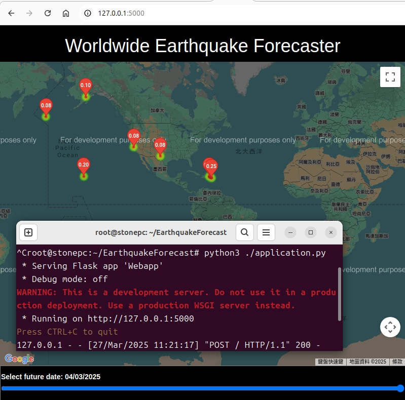

# Earthquake Predict for web view

## Requirements
    click
    Flask
    gunicorn
    itsdangerous
    Jinja2
    joblib
    MarkupSafe
    numpy
    pandas
    python-dateutil
    pytz
    scikit-learn
    scipy
    six
    sklearn
    SQLAlchemy
    threadpoolctl
    Werkzeug
    xgboost

## Run
    python3 ./application.py

## Chrome or Firefox
    http://127.0.0.1:5000

## Demo

##
##### Original source by Aditya Srichandan
